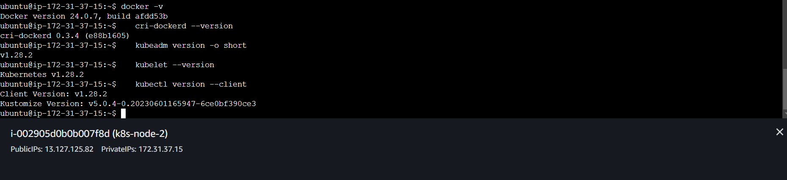

**[Name: Nishant Gupta]{.underline}**

**[Email: ngofficial99@gmail.com]{.underline}**

**[Tasks To Be Performed:]{.underline}**

1\. Deploy a Kubernetes cluster for 3 nodes

2\. Create a NGINX deployment of 3 replicas

Task 1:

-   We will create 3 ec2 instances one for Master and 2 for slaves.

{width="6.267716535433071in"
height="2.5972222222222223in"}

-   I will ssh into all three of them.

-   And update all three of them by running the command.

{width="6.267716535433071in"
height="2.9444444444444446in"}

{width="6.267716535433071in"
height="2.763888888888889in"}

{width="6.267716535433071in"
height="2.9583333333333335in"}

-   We will install docker in all three of them by running the following
    > script.

> sudo wget
> https://raw.githubusercontent.com/lerndevops/labs/master/scripts/installDocker.sh
> -P /tmp
>
> sudo chmod 755 /tmp/installDocker.sh
>
> sudo bash /tmp/installDocker.sh
>
> sudo systemctl restart docker.service

{width="6.267716535433071in"
height="2.8055555555555554in"}

{width="6.267716535433071in"
height="2.861111111111111in"}

{width="6.267716535433071in"
height="2.75in"}

-   Now we can install Docker CRI on all the nodes by running the
    > following command,

> sudo wget
> https://raw.githubusercontent.com/lerndevops/labs/master/scripts/installCRIDockerd.sh
> -P /tmp
>
> sudo chmod 755 /tmp/installCRIDockerd.sh
>
> sudo bash /tmp/installCRIDockerd.sh
>
> sudo systemctl restart cri-docker.service

{width="6.267716535433071in"
height="2.7083333333333335in"}

{width="6.267716535433071in"
height="2.6805555555555554in"}

{width="6.267716535433071in"
height="2.6944444444444446in"}

-   Now we can install kubeadm, kubelet and kubectl.

-   Run the following commands on all the nodes.

> sudo wget
> https://raw.githubusercontent.com/lerndevops/labs/master/scripts/installK8S.sh
> -P /tmp
>
> sudo chmod 755 /tmp/installK8S.sh
>
> sudo bash /tmp/installK8S.sh

{width="6.267716535433071in"
height="1.5416666666666667in"}

{width="6.267716535433071in"
height="1.7083333333333333in"}

{width="6.267716535433071in"
height="1.5416666666666667in"}

-   We will Validate all the installations on all the nodes by running
    > the following commands .

> docker -v
>
> cri-dockerd \--version
>
> kubeadm version -o short
>
> kubelet \--version
>
> kubectl version \--client

{width="6.267716535433071in"
height="1.0555555555555556in"}

{width="6.267716535433071in"
height="1.4027777777777777in"}

{width="6.267716535433071in"
height="1.4305555555555556in"}

-   Now we will run the Kubernetes master node. We will run the
    > following commands only on the master node.

> sudo kubeadm init \--cri-socket unix:///var/run/cri-dockerd.sock
> \--ignore-preflight-errors=all
>
> sudo mkdir -p \$HOME/.kube
>
> sudo cp -i /etc/kubernetes/admin.conf \$HOME/.kube/config
>
> sudo chown \$(id -u):\$(id -g) \$HOME/.kube/config

{width="6.267716535433071in"
height="2.861111111111111in"}

-   We have successfully initialised Master node, we need to install a
    > networking agent. We will be using calico.

-   To do this we will be running the following command on the master
    > node.

    -   kubectl apply -f
        > https://raw.githubusercontent.com/projectcalico/calico/v3.24.1/manifests/calico.yaml

{width="6.267716535433071in"
height="2.611111111111111in"}

-   Now we run kubectl get nodes to check if our master node is active.

{width="6.267716535433071in"
height="1.3333333333333333in"}

-   Now we can use the join command inside the nodes to connect to the.

-   We have to create join command in the master node to do that we will
    > run the following command.

    -   kubeadm token create \--print-join-command

{width="6.267716535433071in"
height="0.7638888888888888in"}

-   We will copy the join command and use the sudo in front of this
    > command and run inside the nodes.

-   Make sure you add \--cri-socket unix:///var/run/cri-dockerd.sock

-   At the end of the join command.

{width="6.267716535433071in"
height="2.2083333333333335in"}

{width="6.267716535433071in"
height="1.75in"}

-   We have added both the nodes to our master. We can cross check by
    > running kubectl get nodes on the master cluster.

{width="6.267716535433071in"
height="1.2777777777777777in"}

**[Task 2:]{.underline}**

-   To create a NGINX we will run the following commands.

    -   kubectl create deployment nginx-deployment \--image=nginx
        > \--replicas=3

{width="6.267716535433071in"
height="0.8055555555555556in"}

-   We can cross check the deployment by running the following command.

    -   Kubectl get deployments

{width="6.267716535433071in"
height="1.5in"}

As we can see the deployment is ready with all 3 replicas.
